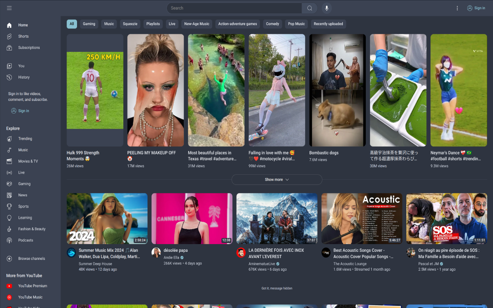
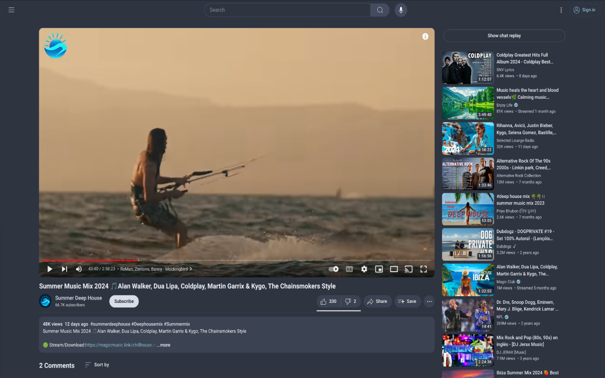
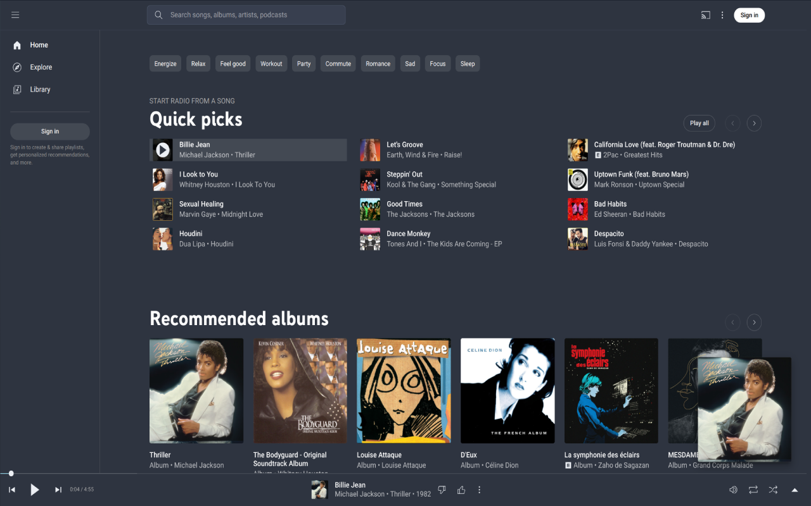
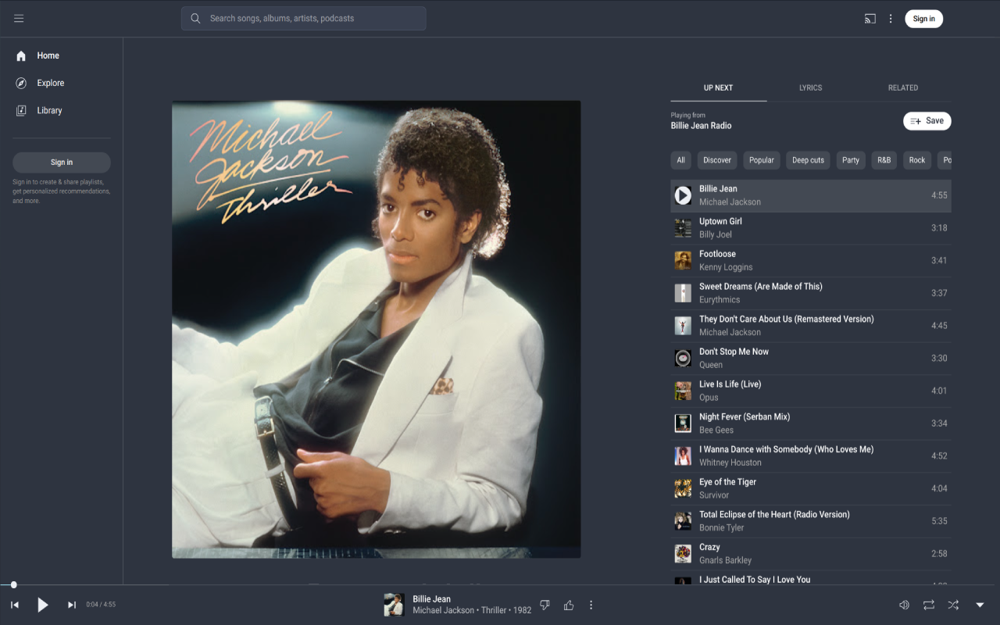
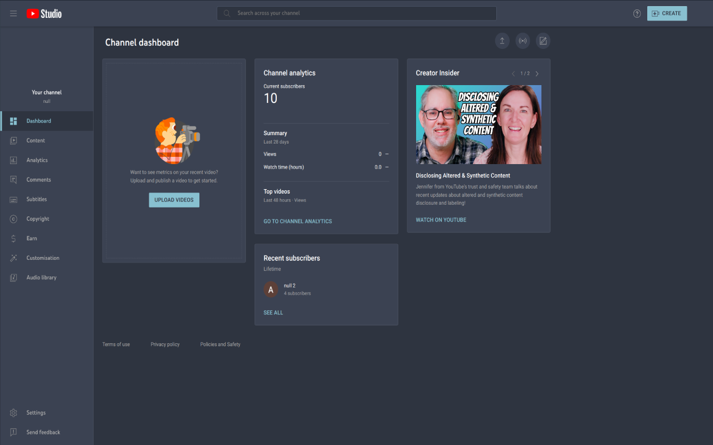
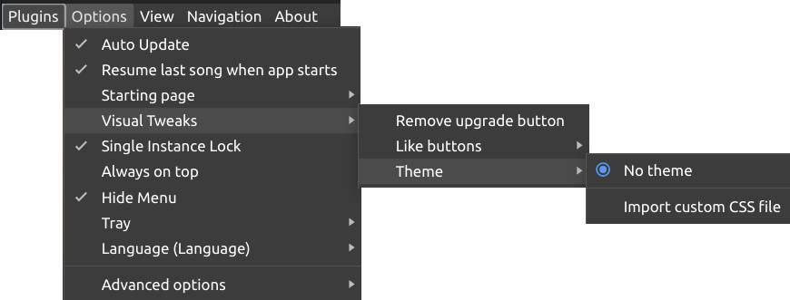

# Preview

# Installing for the web

To use this theme on the web, you just have to install this extension. To do so, go to the [Chrome web store](https://github.com/Angus-Paillaugue/YT-Music-Nord-Theme) then click on install. That's it!

# Installing for an app

Personally, I use the [YouTube Music](https://github.com/th-ch/youtube-music) app (unofficial). To us the theme in the app. You just clone the repo (`git clone https://github.com/Angus-Paillaugue/YT-Music-Nord-Theme`), then compile the scss file by running `./compile.sh`, after compiling, move the `./prod-css/yt-music.css` file wherever you want to store it (I put it in the app config directory : `/.config/YouTube Music`). Then import the theme via `Options -> Visual Tweaks -> Theme -> Import custom CSS file` : 

Then select the css file from the cloned repository.

# Modifying

To modify this extension to suit you. You can clone the repository (`git clone https://github.com/Angus-Paillaugue/YT-Music-Nord-Theme.git`).
The color palette is located the the `nord.scss` file.
The actual css for the pages is in `./dev-css/`. There are multiple scss files (one fcontent_scriptsor each page). To compile the files, there is a util bash file named `compile.sh`. Just run it and it will create the `prod-css` directory and compile all the files in dev-css and put their compiled version there.
If you want to add a new custom page, don't forget to also add the entry in the `manifest.json` under `content_scripts`.
